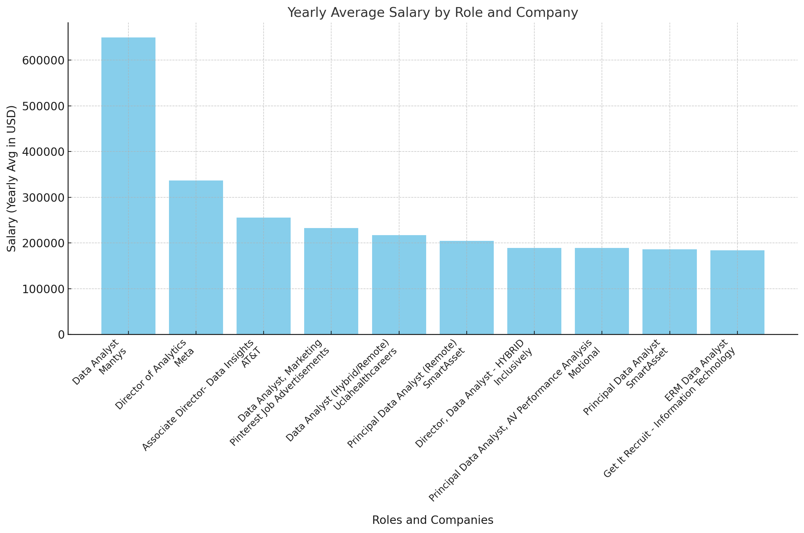

# Introduction
Dive into the data job market! Focusing on data analyst roles, this project explores top-paying jobs, and in demand skills, and the meeting pooint where high demand meets high salary in data analytics.

SQL wueries? Check them out here: [project_sql folder](/SQL_PROJECT_DATA_JOB_ANALYSIS/project_sql/)

# Background
Driven by a
quest to navigate the data analyst job market more effectively, this project was born from a desire to pinpoint top-paid and in-demand skills, streamlining others work to find optimal
jobs. Data hails from my [SQL Coursel (https:// lukebarousse.com/sql). It's packed with insights on job titles, salaries, locations, and essential
skills.

### The questions I wanted to answer through my
SQL queries were:
1. What are the top-paying remote data analyst jobs? 
2. What skills are required for these top-paying jobs? 
3. What skills are most in demand for data analysts? 
4. Which skills are associated with higher salaries?
5. What are the most optimal skills to learn?

# Tools I Used
For my deep dive into the data analyst job market,
I harnessed the power of several key tools:
- SQL: The backbone of my analysis, allowing me to
query the database and unearth critical insights.
- PostgreSQL: The chosen database management
system, ideal for handling the job posting data. 
- Visual Studio Code: My go-to for database
management and executing SQL queries.
- Git & GitHub: Essential for version control and sharing my SQL scripts and analysis, ensuring
collaboration and project tracking.

# The Analysis
Each query for this project aimed at investigating specific aspects of the data analyst job market. Here's how I approached each question:

### 1. Top Paying Remote Data Analyst Jobs
To identify the highest-paying roles! I filtered data analyst positions by average yearly salary and location, focusing on remote jobs. This query highlights the high paying opportunities in the field.

```sql
SELECT
    job_id,
    job_title,
    job_title_short,
    job_location,
    job_schedule_type,
    salary_year_avg,
    job_posted_date::DATE,
    company_dim.name AS company_name
FROM 
    job_postings_fact
LEFT JOIN company_dim ON job_postings_fact.company_id = company_dim.company_id
WHERE
    job_title_short = 'Data Analyst' AND 
    salary_year_avg IS NOT NULL AND
    job_location = 'Anywhere'
ORDER BY 
    salary_year_avg DESC
LIMIT 10

```

Here's the breakdown of the top data analyst jobs in 2023:
- **Wide Salary Range:** Top 10 paying data analyst roles span from $184,000 to $650,000, indicating significant salary potential in the
field.
- **Diverse Employers:** Companies Like SmartAsset, Meta, and AT&T are among those offering high salaries, showing a broad interest
across different industries.
- **Job Title Variety:** There's a high diversity in job titles, from Data Analyst to Director of Analytics, reflecting varied roles and specializations within data analytics.

<br/>


*Bar graph visualizing the salary for the top to salaries for data analysts. Generated by ChatGPT using my SQL query results*

### 2. Skills required for top paying Data Analyst jobs
To identify the top skills required for the highest paying data analyst roles, I used a CTE of the previous query and joined it with my skills tables. This query returns the skills required at these high paying data analyst jobs

```sql
WITH top_paying_jobs AS (
    SELECT
        job_id,
        job_title,
        job_location,
        salary_year_avg,
        company_dim.name AS company_name
    FROM 
        job_postings_fact
    LEFT JOIN company_dim ON job_postings_fact.company_id = company_dim.company_id
    WHERE
        job_title_short = 'Data Analyst' AND 
        salary_year_avg IS NOT NULL AND
        job_location = 'Anywhere'
    ORDER BY 
        salary_year_avg DESC
    LIMIT 10
)

SELECT 
    top_paying_jobs.*,
    skills_dim.skills AS skill_name
FROM top_paying_jobs
INNER JOIN skills_job_dim ON top_paying_jobs.job_id = skills_job_dim.job_id
INNER JOIN skills_dim ON skills_job_dim.skill_id = skills_dim.skill_id
ORDER BY salary_year_avg DESC
```

Small sample of the results of the query

| Skill Name   | Job Title                            | Company Name                                      | Salary (Yearly Avg) |
|--------------|--------------------------------------|--------------------------------------------------|---------------------|
| SQL          | Associate Director- Data Insights   | AT&T                                             | 255829.5           |
| Python       | Associate Director- Data Insights   | AT&T                                             | 255829.5           |
| R            | Associate Director- Data Insights   | AT&T                                             | 255829.5           |
| Azure        | Associate Director- Data Insights   | AT&T                                             | 255829.5           |
| Databricks   | Associate Director- Data Insights   | AT&T                                             | 255829.5           |
| SQL          | Director, Data Analyst - HYBRID     | Inclusively                                      | 189309.0           |
| Power BI     | Director, Data Analyst - HYBRID     | Inclusively                                      | 189309.0           |
| Tableau      | Director, Data Analyst - HYBRID     | Inclusively                                      | 189309.0           |
| Python       | Director, Data Analyst - HYBRID     | Inclusively                                      | 189309.0           |
| SQL          | Principal Data Analyst, AV Performance Analysis | Motional                               | 189000.0           |
| Python       | Principal Data Analyst, AV Performance Analysis | Motional                               | 189000.0           |
| Tableau      | Principal Data Analyst, AV Performance Analysis | Motional                               | 189000.0           |
| Azure        | Principal Data Analyst, AV Performance Analysis | Motional                               | 189000.0           |
| Databricks   | Principal Data Analyst, AV Performance Analysis | Motional                               | 189000.0           |
| SQL          | Principal Data Analyst              | SmartAsset                                       | 186000


### 3. Most in demand skills for data analysts? 
Query
```sql
SELECT 
    skills,
    COUNT(skills_job_dim.job_id) AS demand_count
FROM job_postings_fact
INNER JOIN skills_job_dim ON job_postings_fact.job_id = skills_job_dim.job_id
INNER JOIN skills_dim ON skills_job_dim.skill_id = skills_dim.skill_id
WHERE job_title_short = 'Data Analyst'
GROUP BY skills
ORDER BY demand_count DESC
LIMIT 10
```

Results
| Skills      | Demand Count |
|-------------|--------------|
| SQL         | 92,628       |
| Excel       | 67,031       |
| Python      | 57,326       |
| Tableau     | 46,554       |
| Power BI    | 39,468       |
| R           | 30,075       |
| SAS         | 28,068       |
| PowerPoint  | 13,848       |
| Word        | 13,591       |
| SAP         | 11,297       |


### 4. Skills associated with higher salaries
query
```sql
SELECT 
    skills,
    ROUND(AVG(salary_year_avg), 0) AS avg_salary
FROM job_postings_fact
INNER JOIN skills_job_dim ON job_postings_fact.job_id = skills_job_dim.job_id
INNER JOIN skills_dim ON skills_job_dim.skill_id = skills_dim.skill_id
WHERE job_title_short = 'Data Analyst' AND salary_year_avg IS NOT NULL AND job_location = 'Anywhere'
GROUP BY skills
ORDER BY avg_salary DESC
LIMIT 25
```

results

| Skills          | Average Salary (USD) |
|------------------|-----------------------|
| Pyspark         | 208,172               |
| Bitbucket       | 189,155               |
| Couchbase       | 160,515               |
| Watson          | 160,515               |
| Datarobot       | 155,486               |
| Gitlab          | 154,500               |
| Swift           | 153,750               |
| Jupyter         | 152,777               |
| Pandas          | 151,821               |
| Elasticsearch   | 145,000               |
| Golang          | 145,000               |
| Numpy           | 143,513               |
| Databricks      | 141,907               |
| Linux           | 136,508               |
| Kubernetes      | 132,500               |
| Atlassian       | 131,162               |
| Twilio          | 127,000               |
| Airflow         | 126,103               |
| Scikit-learn    | 125,781               |
| Jenkins         | 125,436               |
| Notion          | 125,000               |
| Scala           | 124,903               |
| PostgreSQL      | 123,879               |
| GCP             | 122,500               |
| Microstrategy   | 121,619               |


### 5. Most optimal skills to learn
query
```sql
WITH highest_demand_skills AS (
    SELECT 
        skills_dim.skills,
        skills_dim.skill_id,
        COUNT(skills_job_dim.job_id) AS demand_count
    FROM job_postings_fact
    INNER JOIN skills_job_dim ON job_postings_fact.job_id = skills_job_dim.job_id
    INNER JOIN skills_dim ON skills_job_dim.skill_id = skills_dim.skill_id
    WHERE 
        job_title_short = 'Data Analyst' AND
        job_work_from_home = True AND
        salary_year_avg IS NOT NULL
    GROUP BY skills_dim.skill_id
), highest_paying_skills AS (
    SELECT 
        skills_job_dim.skill_id,
        ROUND(AVG(salary_year_avg), 0) AS avg_salary
    FROM job_postings_fact
    INNER JOIN skills_job_dim ON job_postings_fact.job_id = skills_job_dim.job_id
    INNER JOIN skills_dim ON skills_job_dim.skill_id = skills_dim.skill_id
    WHERE 
        job_title_short = 'Data Analyst' AND
        salary_year_avg IS NOT NULL AND
        job_work_from_home = True
    GROUP BY skills_job_dim.skill_id
)

SELECT
    highest_demand_skills.skill_id,
    highest_demand_skills.skills,
    highest_demand_skills.demand_count,
    highest_paying_skills.avg_salary
FROM highest_demand_skills
INNER JOIN highest_paying_skills ON highest_demand_skills.skill_id = highest_paying_skills.skill_id
WHERE highest_demand_skills.demand_count > 10
ORDER BY 
    highest_paying_skills.avg_salary DESC,
    highest_demand_skills.demand_count DESC
LIMIT 25
```

results

| Skills       | Demand Count | Average Salary (USD) |
|--------------|--------------|----------------------|
| Python       | 236          | 101,397              |
| Tableau      | 230          | 99,288               |
| Go           | 27           | 115,320              |
| Snowflake    | 37           | 112,948              |
| Azure        | 34           | 111,225              |
| BigQuery     | 13           | 109,654              |
| AWS          | 32           | 108,317              |
| Java         | 17           | 106,906              |
| SSIS         | 12           | 106,683              |
| Jira         | 20           | 104,918              |
| Oracle       | 37           | 104,534              |
| Looker       | 49           | 103,795              |
| NoSQL        | 13           | 101,414              |
| R            | 148          | 100,499              |
| Redshift     | 16           | 99,936               |
| Qlik         | 13           | 99,631               |
| Spark        | 13           | 99,077               |
| C++          | 11           | 98,958               |
| SAS          | 63           | 98,902               |
| SQL Server   | 35           | 97,786               |
| JavaScript   | 20           | 97,587               |
| Confluence   | 11           | 114,210              |
| Hadoop       | 22           | 113,193              |
| Python       | 236          | 101,397              |


# What I Learned
Throughout this adventure, I've turbocharged my
SQL toolkit with some serious firepower:
- **Complex Query Crafting:** Mastered the art
of advanced SQL, merging tables like a pro and wielding WITH clauses for ninja-level temp table
maneuvers. 
- **Data Aggregation:** Got cozy with GROUP BY
and turned aggregate functions like COUNT() and AVG
(into my data-summarizing sidekicks. 
- **Analytical Wizardry:** Leveled up my real-world puzzle-solving skills, turning
questions into actionable, insightful SQL queries.

# Conclusions
### Insights
1. **Top-Paying Data Analyst Jobs**; The highest-paying jobs for data analysts that allow remote work offer a wide range of salaries, the
highest at $650,000!
2. **Skills for Top-Paying Jobs**; High-paying data analyst jobs require advanced proficiency in SQL, suggesting it's a critical skill for earning
a
top salary.
3. **Most In-Demand Skills**; SQL is also the most demanded skill in the data analyst job market,
thus making it essential for job seekers.
4. **Skills with Higher Salaries**; Specialized skills, such as SVN and Solidity, are associated with the highest average salaries, indicating a
premium on niche expertise.
5. **Optimal Skills for Job Market Value**: SQL
leads in demand
and offers for a high average salary, positioning it as one of the most optimal skills for data analysts to learn to maximize
their market value.

### Closing Thoughts
This project enhanced my SQL skills and provided valuable insights into the data analyst job market. The findings from the analysis serve as a guide to prioritizing skill development and job search efforts. Aspiring data analysts can better position themselves in a competitive job market by focusing on high-demand, high-salary skills. This exploration highlights the importance of continuous learning and adaptation to emerging
trends in the field of data analytics.
